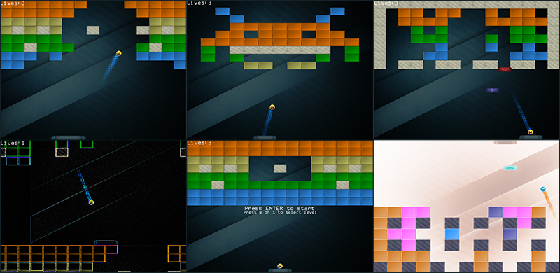

# Breakout 2D — OpenGL и ECS

[English](README.md) | **Русский**

Реализация Breakout на C++17 с собственной **Entity Component System (ECS)** — системой сущностей, компонентов и систем. Репозиторий объединяет двумерную игру и модули движка для рендеринга, обнаружения столкновений, ввода, звука, интерфейса, загрузки ресурсов и управления памятью.

Управляйте платформой, отбивайте мяч и разбивайте все разрушаемые блоки. В игре есть четыре уровня на выбор, падающие бонусы, след из частиц и шейдерные эффекты постобработки.



[Возможности](#возможности) · [Управление](#управление) · [Сборка и запуск](#сборка-и-запуск) · [Архитектура](#архитектура) · [Конфигурация](#конфигурация) · [Формат уровней](#формат-уровней)

## Возможности

- **Классическая механика Breakout:** прочные и разрушаемые блоки, направление отскока в зависимости от точки попадания в платформу, счётчик жизней, победа и поражение.
- **Четыре уровня на выбор:** Standard, A few small gaps, Space invader и Bounce galore.
- **Меню и пауза:** выбор уровня перед игрой, приостановка игры и возврат в меню со сбросом текущей попытки.
- **Рендеринг на OpenGL:** инстансинг спрайтов, след из частиц, постобработка через framebuffer и вывод текста с помощью FreeType.
- **Звук:** фоновая музыка и звуки столкновений через irrKlang.
- **Собственная ECS:** отдельные пулы для типов компонентов, общие компоненты префабов и системы игровой логики, физики и рендеринга.
- **Редактируемые ресурсы и настройки:** XML-конфигурация и уровни в виде текстовых сеток.

## Управление

| Состояние | Клавиша | Действие |
| --- | --- | --- |
| Главное меню | `A` / `D` | Выбрать предыдущий / следующий уровень |
| Главное меню | `Enter` / `Space` | Начать выбранный уровень |
| Игра | `A` / `D` | Двигать платформу влево / вправо |
| Игра | `Space` | Запустить мяч, прикреплённый к платформе |
| Игра | `Enter` / `Esc` | Поставить игру на паузу |
| Пауза | `Enter` | Продолжить игру |
| Пауза | `Esc` | Сбросить текущую попытку и вернуться в главное меню |
| Экран победы / поражения | `Enter` / `Space` | Вернуться в главное меню |

Для выхода закройте окно игры. Уничтожение всех разрушаемых блоков завершает выбранный уровень победой; потеря всех жизней завершает попытку. Начальное количество жизней задаётся в `assets/config.xml` и составляет **5**.

### Бонусы

Ловите падающие предметы платформой. В коде определены шесть типов; их текущее поведение:

| Тип | Поведение |
| --- | --- |
| Sticky | При следующем столкновении с платформой мяч прилипает к ней; `Space` запускает его снова. |
| Pad Size Increase | Временно увеличивает ширину платформы в 1,5 раза относительно значения из конфигурации. |
| Confuse | Временно переворачивает сцену по обеим осям и инвертирует цвета. |
| Chaos | Временно применяет фильтр выделения границ и анимированное смещение текстуры. |
| PassThrough | Временно отключает реакцию мяча на столкновения с блоками и платформой, включая разрушение блоков. |
| Speed | Предмет и функции изменения скорости существуют, но активация закомментирована: подбор не ускоряет мяч. |

Появление бонусов, активация и таймеры реализованы в [PowerUpSystem.cpp](source/sys_gameplay/PowerUpSystem.cpp). Таблица описывает текущее состояние кода, включая незавершённое поведение Speed и PassThrough.

## Сборка и запуск

### Требования

- **Windows**, целевая архитектура сборки — **x86 / Win32**.
- **Visual Studio 2019** с рабочей нагрузкой **«Разработка классических приложений на C++»**, набором инструментов **MSVC v142** и Windows SDK. Поставляемый скрипт генерирует проекты для VS 2019.
- Видеодрайвер с поддержкой **OpenGL 4.3 Core**; шейдеры используют GLSL 4.30.

Premake, а также используемые сторонние заголовки, исходники, библиотеки и DLL уже включены в репозиторий. Отдельная установка зависимостей через пакетный менеджер не требуется.

### Генерация и сборка

1. Клонируйте или распакуйте репозиторий в каталог **без пробелов**: существующие команды копирования после сборки содержат пути без кавычек.
2. Из корня репозитория выполните:

   ```powershell
   .\generate.bat
   ```

3. Откройте `.gen/prj/Breakout.sln` или воспользуйтесь созданным ярлыком `Breakout.lnk`.
4. Назначьте **Game** запускаемым проектом — **Set as Startup Project**.
5. Выберите **Release | Win32** или **Debug | Win32** и соберите решение.

После генерации решение также можно собрать из Visual Studio Developer Command Prompt:

```bat
msbuild .gen\prj\Breakout.sln /m /p:Configuration=Release /p:Platform=Win32
```

В репозиторий включён Premake **5.0.0-alpha15**. При использовании более новой Visual Studio откройте сгенерированное решение VS 2019 и установите набор инструментов v142 либо переназначьте решение на установленный набор инструментов и SDK. Сохраните платформу **Win32**: скрипты сборки и готовые бинарные зависимости рассчитаны на x86. Встроенный Premake не поддерживает команду `vs2022`.

### Запуск

После сборки исполняемый файл, DLL и каталог `assets/` копируются в `.bin/`. Для запуска Release-сборки из корня репозитория выполните:

```powershell
Set-Location .bin
.\Breakout.exe
```

Для Debug-сборки запустите `Breakout-d.exe` из того же каталога.

**Рабочий каталог должен содержать `assets/`.** Пути к конфигурации и ресурсам вычисляются относительно него. При отладке в Visual Studio после успешной сборки можно использовать рабочий каталог `$(ProjectDir)`: шаг после сборки также копирует ресурсы в `.gen/prj/assets/`.

### Если возникли проблемы

| Симптом | Что проверить |
| --- | --- |
| Не найден MSVC toolset или Windows SDK | Установите набор инструментов / SDK, указанный в решении, либо переназначьте его в Visual Studio. |
| Ошибка линковки из-за несовпадения архитектур | Используйте **Win32**, как и включённые в проект библиотеки. |
| Не найдены `irrKlang.dll`, `ikpMP3.dll` или `freetype.dll` | Проверьте успешность копирования после сборки и наличие DLL рядом с исполняемым файлом. |
| Не загружаются конфигурация, текстуры или уровни | Запускайте игру из `.bin/` и проверьте наличие каталога `assets/` внутри него. |
| Ошибка создания окна GLFW или инициализации шейдеров | Проверьте поддержку OpenGL 4.3 активным видеодрайвером. |
| Изменения ресурсов не видны в игре | Обновите копию ресурсов в рабочем каталоге и перезапустите игру. |

## Архитектура

Точка входа находится в [game.cpp](source/game/game.cpp). [GameEngine](source/game/gameEngine.cpp) инициализирует окно, ресурсы и системы, а [ECSBreakout](source/game/ECSBreakout.cpp) создаёт пулы компонентов, игровой мир и обработчики клавиш для переходов между состояниями.

Основной цикл обновляет **физику → игровую логику → рендеринг**, переключает буферы событий, затем опрашивает события окна и меняет буферы изображения. Физика и игровая логика обновляются только в активном состоянии игры. Рендеринг рисует спрайты и частицы, применяет постобработку и затем выводит интерфейс.

### Устройство ECS

- **Сущности** имеют числовые идентификаторы и ссылки на свои компоненты; ими управляет `EntityManager`.
- **Компоненты** хранят данные: трансформации, коллайдеры, движение, здоровье и свойства спрайтов. `ComponentManager` размещает каждый тип в пуле фиксированной вместимости со списком свободных элементов.
- **Префабы** позволяют нескольким сущностям ссылаться на один общий компонент. Например, блоки используют общие данные спрайта, сохраняя собственные трансформации и, для разрушаемых блоков, цвета. Рендерер объединяет такие спрайты в инстансированные вызовы отрисовки.
- **Системы** реализуют поведение на основе данных компонентов. `SystemManager` создаёт экземпляры систем; порядок обновления задают движок и объединяющие системы.
- **События** используют делегаты с несколькими подписчиками для уведомлений о столкновениях и смене уровней, а также два чередующихся буфера для отложенных событий.

### Структура исходников

| Путь | Назначение |
| --- | --- |
| [source/game/](source/game/) | Точка входа, цикл движка, игровой контекст, создание сущностей, загрузка уровней и привязка ресурсов |
| [source/sys_ecs/](source/sys_ecs/) | Сущности, компоненты, общие префабы и управление системами |
| [source/sys_gameplay/](source/sys_gameplay/) | Логика платформы и мяча, разрушение блоков, жизни и бонусы |
| [source/sys_physics/](source/sys_physics/) | Обнаружение столкновений окружности с прямоугольником и двух прямоугольников |
| [source/sys_animation/](source/sys_animation/) | Отрисовка спрайтов и частиц, постобработка и порядок рендеринга |
| [source/lib_multimedia/OGLML/](source/lib_multimedia/OGLML/) | Обёртки OpenGL для шейдеров, текстур, спрайтов, текста, частиц и framebuffer |
| [source/sys_input/](source/sys_input/), [source/sys_events/](source/sys_events/) | Клавиатурный ввод, делегаты и буферы событий |
| [source/sys_gameState/](source/sys_gameState/), [source/sys_ui/](source/sys_ui/) | Переходы между состояниями, экраны меню и текстовые виджеты |
| [source/sys_config/](source/sys_config/), [source/sys_resource/](source/sys_resource/) | XML-конфигурация, идентификаторы, загрузка и менеджеры ресурсов |
| [source/sys_audio/](source/sys_audio/), [source/sys_telemetry/](source/sys_telemetry/) | Музыка, звуковые эффекты и вывод логов в консоль |
| [source/sys_memory/](source/sys_memory/) | Пулы объектов и линейный аллокатор |
| [source/sys_profile/](source/sys_profile/) | Заготовка модуля профилирования |
| [assets/](assets/) | Конфигурация, уровни, шейдеры, текстуры, шрифты, звуки, музыка и скриншоты |
| [libraries/](libraries/) | Сторонние зависимости, включённые в репозиторий |
| [make/](make/) | Исполняемый файл Premake и Lua-скрипты сборки |

Сгенерированные проекты, промежуточные файлы и результаты сборки находятся в `.gen/`; в `.bin/` копируются файлы для запуска. Оба каталога исключены из Git.

### Зависимости

| Зависимость | Использование в проекте |
| --- | --- |
| OpenGL + GLEW | Графический API и загрузка функций OpenGL |
| GLFW | Окно, графический контекст, события клавиатуры и время |
| GLM | Математика для графики |
| stb_image | Декодирование изображений |
| FreeType | Загрузка шрифтов и растеризация символов |
| irrKlang | Воспроизведение музыки и звуков, включая MP3-плагин |
| tinyxml2 | Разбор XML |
| Premake | Генерация решения и проектов Visual Studio |

## Конфигурация

[assets/config.xml](assets/config.xml) загружается при старте игры и содержит:

| Раздел | Настройки |
| --- | --- |
| `window` | Заголовок и размеры окна; задано 800 × 600 |
| `FPS` | Настройка интервала между кадрами, которую читает основной цикл |
| `components` | Идентификаторы типов компонентов и вместимость их пулов |
| `gameMaps` | Список уровней и пути к файлам `.lvl` |
| `assets` | Идентификаторы и пути шейдеров, текстур, шрифтов, звуков и музыки |
| `initData` | Размеры и скорости платформы и мяча, размер и скорость бонусов, начальное количество жизней |

Например, для изменения начального количества жизней отредактируйте существующую запись `playerLives`:

```xml
<init id="6" name="playerLives" val1="5" val2="0"></init>
```

Числовые идентификаторы должны соответствовать перечислениям в C++. Уровни выбираются по позиции записи в `gameMaps`, поэтому сохраняйте и их порядок. Исходные ресурсы копируются на шаге после сборки игры: после редактирования пересоберите проект **Game** либо скопируйте изменённые файлы в используемый при запуске каталог `assets/`, затем перезапустите игру.

## Формат уровней

Уровни в [assets/levels/](assets/levels/) представляют собой прямоугольные сетки целых чисел, разделённых пробелами:

```text
1 1 1 1 1 1
2 2 0 0 2 2
3 3 4 4 3 3
5 5 5 5 5 5
```

| Значение | Ячейка |
| --- | --- |
| `0` | Пустое место |
| `1` | Прочный неразрушаемый блок |
| `2` | Синий разрушаемый блок |
| `3` | Зелёный разрушаемый блок |
| `4` | Жёлтый разрушаемый блок |
| `5` | Оранжевый разрушаемый блок |

[GameMaps.cpp](source/game/GameMaps.cpp) растягивает сетку на всю ширину окна и верхнюю половину его высоты. Используйте непустые строки одинаковой длины и значения от `0` до `5`.

Чтобы изменить доступные уровни, редактируйте файлы `1.lvl`–`4.lvl`. Файл `0.lvl` связан со значением `None` и не участвует в выборе через меню. Для добавления новых выбираемых уровней также нужно обновить `EGameMapLevels` в [GameMaps.h](source/game/GameMaps.h) и упорядоченный список `gameMaps` в конфигурации.

Для больших карт увеличьте соответствующие пулы компонентов, прежде всего `Transform`, `Collider` и `SpriteColor`, оставив место для платформы, мяча, фона и бонусов. Вместимость пулов фиксирована: автоматически они не расширяются.

## Особенности реализации

- Поставляемые скрипты сборки рассчитаны на Windows и x86; для других платформ потребуется адаптация сборки и зависимостей.
- Активация Speed отключена; PassThrough сейчас пропускает столкновения с платформой и разрушение блоков, как описано выше.
- В рендерере есть реализация постэффекта Shake, но обычная игровая логика сейчас его не активирует.
- `sys_profile` содержит заготовку, а не работающий профилировщик.

## Источники вдохновения

В исходном README указаны:

- [LearnOpenGL — Breakout](https://learnopengl.com/In-Practice/2D-Game/Breakout)
- [Лекция Entity Component Systems & Data Oriented Design](http://aras-p.info/texts/files/2018Academy%20-%20ECS-DoD.pdf)
